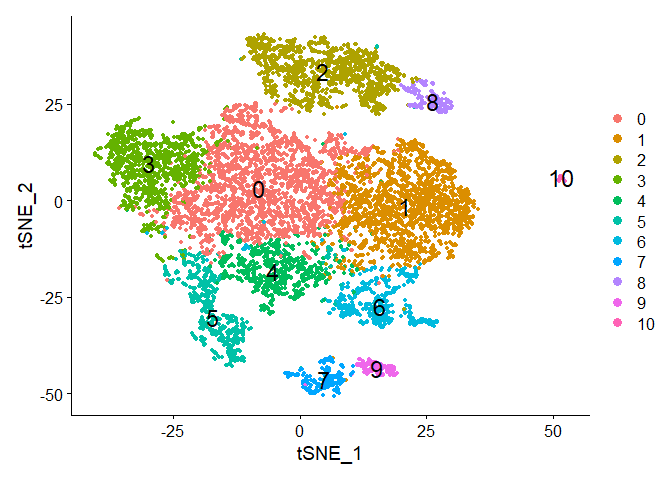

Prostate_Stem_Cell_ScRNAseq_Analysis
================

## Objectives

### Single cell RNA-seq gene expression profiling of prostate basal cell subpopulation using data from the journal article “Identification of a Zeb1 expressing basal stem cell subpopulation in the prostate”

### Wang et al., 2020, Nat Commun 11:706

### Exploration of transcriptional differences and interations among different subpopulations within prostate basal cells

## Source Data and Acknowledgements

### Raw data is accessible from GEO with the following accession code: GSE111429

### Modified script from Bioinformagician: Single-cell Trajectory analysis using Monocle3 and Seurat | Step-by-step tutorial

## Setup

``` r
pacman::p_load(Seurat, dplyr, Matrix, ggpubr, ComplexHeatmap, circlize, fgsea, msigdbr, data.table, ggplot2,
               tidyverse, pathview, monocle3, SeuratWrappers, biomaRt)

rm(list=ls())
```

## Read in data

``` r
exp_data <- Read10X(data.dir = "./data")
seu.obj <- CreateSeuratObject(count = exp_data)
seu.obj <- PercentageFeatureSet(seu.obj, pattern = "^mt-", col.name = "mitopercent")
before <- VlnPlot(seu.obj, features =c('nFeature_RNA','nCount_RNA','mitopercent'))
```

## Calculate % mitochondria (dying cells)

``` r
# Poor-quality cells with less than 1000 genes detected, less than 5000 UMIs or more than 5% UMI mapped to mitochondria genes were removed. 
seu.obj <- subset(seu.obj, subset = nFeature_RNA > 1400 & nCount_RNA > 5000 & mitopercent < 5)
after <- VlnPlot(seu.obj, features =c('nFeature_RNA','nCount_RNA','mitopercent'))
```

    ## Warning: Default search for "data" layer in "RNA" assay yielded no results;
    ## utilizing "counts" layer instead.

``` r
ggarrange(before,after, ncol = 2, nrow = 1)
```

<!-- -->

## Data Preprocessing using Seurat Object

``` r
seu.obj <- NormalizeData(seu.obj, normalization.method='LogNormalize', scale.factor=1e4)
```

    ## Normalizing layer: counts

``` r
seu.obj <- FindVariableFeatures(seu.obj,
                               nfeatures = 1606,
                               mean.cutoff = c(0.0125,3),
                               dispersion.cutoff = c(0.5, Inf))
```

    ## Finding variable features for layer counts

``` r
seu.obj <- ScaleData(seu.obj, vars.to.regress=c('nCount_RNA','mitopercent'))
```

    ## Regressing out nCount_RNA, mitopercent

    ## Centering and scaling data matrix

``` r
seu.obj <- RunPCA(seu.obj, features = seu.obj@assays$RNA@meta.data$var.features, verbose = TRUE, 
                 ndims.print=1:5, nfeatures.print = 5)
```

    ## PC_ 1 
    ## Positive:  Cdh5, Pecam1, Emcn, Ramp2, Cd93 
    ## Negative:  Krt15, Krt18, Cldn4, Epcam, Sfn 
    ## PC_ 2 
    ## Positive:  Hbegf, Krt14, Junb, Apoe, Sfn 
    ## Negative:  Birc5, Nusap1, Cdca8, Cdca3, Ccna2 
    ## PC_ 3 
    ## Positive:  Ly6e, Cd93, Tspan13, Flt1, Pecam1 
    ## Negative:  Col1a2, Col1a1, Col6a1, Col3a1, Col6a2 
    ## PC_ 4 
    ## Positive:  Wfdc15b, Pdzk1ip1, Cd52, Tspan8, Plac8 
    ## Negative:  Krt15, Palld, Nr4a2, Odc1, Col4a1 
    ## PC_ 5 
    ## Positive:  Wfdc15b, Tspan8, Pdzk1ip1, Cldn3, Plac8 
    ## Negative:  Tyrobp, Fcer1g, C1qc, C1qa, C1qb

``` r
PCAPlot(seu.obj, dims = c(1, 2))
```

<!-- -->

``` r
DimHeatmap(seu.obj, dims = 1:12, cells = 500, balanced = TRUE)
```

<!-- -->

``` r
seu.obj <- FindNeighbors(seu.obj, dims = 1:12)
```

    ## Computing nearest neighbor graph

    ## Computing SNN

``` r
seu.obj <- FindClusters(seu.obj, resolution=c(0.2,0.3,0.4,0.5))
```

    ## Modularity Optimizer version 1.3.0 by Ludo Waltman and Nees Jan van Eck
    ## 
    ## Number of nodes: 9833
    ## Number of edges: 323440
    ## 
    ## Running Louvain algorithm...
    ## Maximum modularity in 10 random starts: 0.9244
    ## Number of communities: 10
    ## Elapsed time: 0 seconds
    ## Modularity Optimizer version 1.3.0 by Ludo Waltman and Nees Jan van Eck
    ## 
    ## Number of nodes: 9833
    ## Number of edges: 323440
    ## 
    ## Running Louvain algorithm...
    ## Maximum modularity in 10 random starts: 0.9059
    ## Number of communities: 11
    ## Elapsed time: 0 seconds
    ## Modularity Optimizer version 1.3.0 by Ludo Waltman and Nees Jan van Eck
    ## 
    ## Number of nodes: 9833
    ## Number of edges: 323440
    ## 
    ## Running Louvain algorithm...
    ## Maximum modularity in 10 random starts: 0.8921
    ## Number of communities: 12
    ## Elapsed time: 0 seconds
    ## Modularity Optimizer version 1.3.0 by Ludo Waltman and Nees Jan van Eck
    ## 
    ## Number of nodes: 9833
    ## Number of edges: 323440
    ## 
    ## Running Louvain algorithm...
    ## Maximum modularity in 10 random starts: 0.8794
    ## Number of communities: 12
    ## Elapsed time: 0 seconds

``` r
seu.obj <- RunTSNE(seu.obj, dims = 1:12, do.fast=TRUE)
Idents(object = seu.obj) <- seu.obj$RNA_snn_res.0.2
DimPlot(seu.obj, reduction = "tsne", label = TRUE, pt.size = 1, label.size = 6)
```

<!-- -->

``` r
PCAPlot(seu.obj)
```

<!-- -->

## Subset non-epithelial cells

``` r
FeaturePlot(seu.obj, features =c('Cd74','Cd72') , cols =c('yellow','red'), 
            reduction ='tsne', pt.size = 0.7,ncol = 3, label = T)
```

<!-- -->

``` r
FeaturePlot(seu.obj, features = c('Eng','S1pr1','Emcn'), cols =c('yellow','red'), 
            reduction = 'tsne',pt.size = 0.7,ncol=3, label = T)
```

<!-- -->

``` r
v1 <- VlnPlot(seu.obj, features = c("Epcam","Cdh1","Krt5", "Krt14"), ncol = 4) # Epithelial markers
v2 <- VlnPlot(seu.obj, features = c("Igfbp4","Fn1","Gng11"), ncol = 3) # Stromal markers
v3 <- VlnPlot(seu.obj, features = c("Eng","S1pr1","Emcn"), ncol = 3) # Endothelial markers
v4 <- VlnPlot(seu.obj, features = c("Cd74","Cd72"), ncol = 2) # Immune markers
ggarrange(v1, v2, v3, v4, ncol = 1)
```

<!-- -->

## Clustering using Seurat

``` r
seu.obj <- subset(seu.obj, idents = c("4","8"), invert = TRUE)
DefaultAssay(seu.obj) <- "RNA"
seu.obj <- NormalizeData(seu.obj, normalization.method='LogNormalize', scale.factor=1e4)
seu.obj <- FindVariableFeatures(seu.obj, mean.function = ExpMean, 
                               dispersion.function= LogVMR,
                               mean.cutoff = c(0.0125, 3),
                               dispersion.cutoff = c(0.5, Inf))
length(seu.obj@assays$RNA@meta.data$var.features)
#
seu.obj <- ScaleData(seu.obj, vars.to.regress=c('nCount_RNA','percent.mt'))
```

    ## Warning: Requested variables to regress not in object: percent.mt

    ## Warning: Different features in new layer data than already exists for
    ## scale.data

``` r
seu.obj <- RunPCA(seu.obj, features = seu.obj@assays$RNA@meta.data$var.features, verbose = TRUE, 
                 ndims.print=1:5, nfeatures.print = 5)
seu.obj <- FindNeighbors(seu.obj, dims = 1:12)
seu.obj <- FindClusters(seu.obj, resolution=c(0.2,0.3,0.4,0.5))
seu.obj <- RunTSNE(seu.obj, dims = 1:12, do.fast=TRUE)

saveRDS(seu.obj, file = "./results/Prostate.RDS")
```

## Read in data

``` r
seu.obj <- readRDS("./results/Prostate.RDS")
Idents(object = seu.obj) <- seu.obj$RNA_snn_res.0.5
DimPlot(seu.obj, label = T, pt.size = 1, label.size = 6)
```

<!-- -->

``` r
plot <- VlnPlot(seu.obj, features = c("Krt5","Krt14"), combine = FALSE, fill.by = c("feature","ident")) 
plot <-  lapply(
  X = plot,
  FUN = function(p) p + aes(color= seu.obj$RNA_snn_res.0.5)
)
CombinePlots(plots = plot, legend = 'none')
```

    ## Warning: CombinePlots is being deprecated. Plots should now be combined using
    ## the patchwork system.

<!-- -->

## Heatmap

``` r
# Epithelial markers: "Epcam","Cdh1","Krt5", "Krt14" 
# Stromalmarkers: "Igfbp4","Fn1","Gng11"
# Endothelial markers: "Eng","S1pr1","Emcn"
# Immune markers: "Cd74","Cd72"

listsA <- c('Cdh1','Epcam','Cldn1','Ocln','Vim','Fn1','S100a4','Zeb1','Zeb2',
            'Twist1','Twist2','Snai1','Snai2','Prrx1','Prrx2','Foxc2','Cdh2','Acta2')

#cluster 7 showed both epithelial and stromal markers

DoHeatmap(seu.obj, features = listsA, disp.min = -1,
          slot = 'scale.data', 
          group.colors = rainbow(9)) +
  scale_fill_gradient2(low = "blue", mid = "white", high = "red",midpoint = 1)
```

    ## Warning in DoHeatmap(seu.obj, features = listsA, disp.min = -1, slot =
    ## "scale.data", : The following features were omitted as they were not found in
    ## the scale.data slot for the RNA assay: Foxc2, Snai1, Twist1, Zeb1, Ocln, Cdh1

    ## Scale for fill is already present.
    ## Adding another scale for fill, which will replace the existing scale.

<!-- -->
